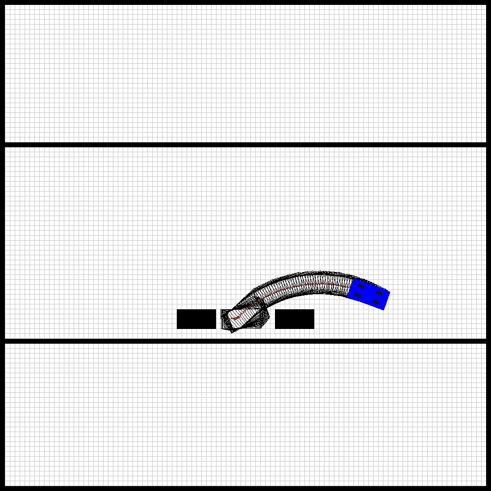
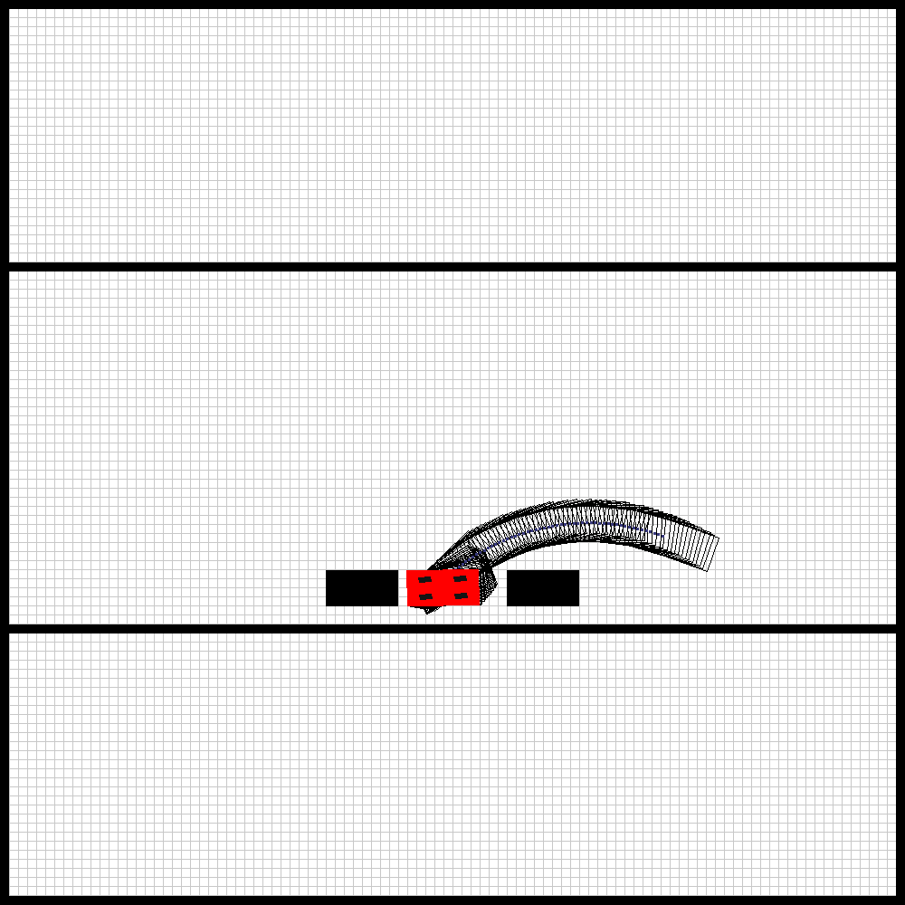

# Geometric Parallel Parking Simulation

A Python-based simulation of autonomous parallel parking using geometric path planning and kinematic bicycle model. This project implements a complete kinematic simulation system for self-driving car parking maneuvers.

## 🎬 Demo

### Animated Parking Maneuver



*Complete parking maneuver from start to finish - shows the vehicle navigating into the parking spot*

### Trajectory Visualization



*Planned geometric path with vehicle footprint at each waypoint. Green outlines show the vehicle's position and orientation throughout the maneuver.*

### Time Series Analysis

The following plots show how vehicle states and control inputs evolve over time during the parking maneuver:

<div align="center">

| Position (X) | Position (Y) | Velocity |
|:------------:|:------------:|:--------:|
|  |  |  |
| **Heading Angle** | **Acceleration** | **Steering Angle** |
|  |  |  |

</div>

**Plot Descriptions:**
- **Position (X, Y)**: Vehicle position coordinates over time, showing the lateral and longitudinal movement
- **Velocity**: Linear velocity profile during the maneuver
- **Heading Angle**: Yaw angle evolution, showing how the vehicle rotates during parking
- **Acceleration**: Longitudinal acceleration input applied to the vehicle
- **Steering Angle**: Steering wheel angle showing the control inputs for turning

### Trajectory Comparison

<div align="center">


</div>

*Comparison of reference path (blue) vs. actual vehicle trajectory (red), demonstrating successful path following*

## Table of Contents

- [Demo](#-demo)
- [Overview](#overview)
- [Features](#features)
- [Technology Stack](#technology-stack)
- [How It Works](#how-it-works)
- [Installation](#installation)
- [Usage](#usage)
- [Project Structure](#project-structure)
- [Mathematical Model](#mathematical-model)
- [Results](#results)
- [References](#references)

## Overview

This project simulates autonomous parallel parking using:
- **Kinematic Bicycle Model**: Simplified car dynamics with nonholonomic constraints
- **Geometric Path Planning**: Circular arc-based trajectory generation
- **Forward Kinematic Simulation**: Real-time vehicle state propagation
- **Visualization**: Interactive and non-interactive rendering with animated GIF output

The simulation demonstrates how a vehicle can autonomously park in a tight spot between two parked cars using geometric path planning algorithms.

## Features

- ✅ Kinematic bicycle model with nonholonomic constraints
- ✅ Geometric path planning for parallel parking
- ✅ Collision detection with obstacles
- ✅ Interactive visualization (OpenCV)
- ✅ Automatic plot generation (time series of states and inputs)
- ✅ Animated GIF output of parking maneuver
- ✅ Model Predictive Control (MPC) support
- ✅ Comprehensive documentation and reports

## Technology Stack

### Core Libraries

- **NumPy**: Numerical computations and array operations
- **SciPy**: Optimization algorithms for MPC controller
- **OpenCV**: Computer vision for rendering and visualization
- **Matplotlib**: Plotting and data visualization
- **ImageIO**: GIF animation generation

### Python Version

- Python 3.7+

## How It Works

### 1. Kinematic Model

The vehicle is modeled using a **bicycle model** (single-track model) that captures essential car dynamics:

```
State: [x, y, v, ψ]ᵀ
Input: [a, δ]ᵀ

Kinematic Equations:
  ẋ = v · cos(ψ)
  ẏ = v · sin(ψ)
  v̇ = a
  ψ̇ = (v · tan(δ)) / L
```

Where:
- `x, y`: Position coordinates [m]
- `v`: Linear velocity [m/s]
- `ψ`: Heading angle [rad]
- `a`: Acceleration [m/s²]
- `δ`: Steering angle [rad]
- `L`: Wheelbase [m]

### 2. Path Planning

The geometric path planner generates trajectories using circular arcs:

- **One-trial path**: For parking spots longer than minimum required length
  - Right turn followed by left turn
  - Single backward maneuver

- **Several-trial path**: For tight parking spots
  - Multiple alternating left-right maneuvers
  - Progressive approach to parking spot

The planner calculates:
- Minimum turning radii based on vehicle geometry
- Required parking length
- Waypoint sequences with corresponding steering angles

### 3. Simulation Loop

1. **Path Planning**: Generate geometric trajectory
2. **State Propagation**: Update vehicle state using Euler integration
3. **Collision Detection**: Check for obstacles at each step
4. **Visualization**: Render current state
5. **Data Logging**: Record states and inputs for analysis

### 4. Control Options

- **Open-loop**: Follow geometric path directly (default)
- **Closed-loop**: Use MPC controller for trajectory tracking

## Installation

### Prerequisites

- Python 3.7 or higher
- pip package manager

### Steps

1. Clone the repository:
```bash
git clone <repository-url>
cd geometric-parallel-parking-main
```

2. Install dependencies:
```bash
pip install -r requirements.txt
```

## Usage

### Interactive Simulation

Run the interactive simulation with OpenCV windows:

```bash
python main.py --x_start 75 --y_start 40 --psi_start -20 --x_end 90 --y_end 80 --parking_length 12 --parking_margin 1
```

**Arguments:**
- `--x_start, --y_start`: Starting position [m]
- `--psi_start`: Starting heading angle [degrees]
- `--x_end, --y_end`: Target end position [m]
- `--parking_length, -p`: Length of parking spot [m]
- `--parking_margin, -m`: Safety margin [m]
- `--use_control, -c`: Enable MPC controller (optional)

**Controls:**
- Press any key to advance through simulation
- Press 's' to save current frame

### Non-Interactive Simulation

Run automated simulation with automatic plot and GIF generation:

```bash
python simulate.py
```

This will:
- Generate time series plots in `log results/` directory
- Create animated GIF in `reports/parking_maneuver.gif`
- Save trajectory visualization in `reports/reference_trajectory.png`
- Print simulation results to console

### Output Files

After running `simulate.py`, you'll find:

**Plots** (`log results/`):
- `x.png`: X-position over time
- `y.png`: Y-position over time
- `v.png`: Velocity over time
- `psi.png`: Heading angle over time
- `accelerate.png`: Acceleration input over time
- `steer.png`: Steering angle input over time
- `position.png`: Trajectory in XY plane

**Visualizations** (`reports/`):
- `parking_maneuver.gif`: Animated GIF of parking maneuver
- `reference_trajectory.png`: Final trajectory visualization

## Project Structure

```
pps/
├── control.py              # Kinematic model and MPC controllers
├── environment.py          # Environment visualization and collision detection
├── pathplanning.py         # Geometric path planning algorithms
├── utils.py                # Data logging and utility functions
├── main.py                 # Interactive simulation script
├── simulate.py             # Non-interactive simulation with plots
├── requirements.txt         # Python dependencies
├── .gitignore              # Git ignore rules
├── README.md               # This file
├── REPORT.md                # Detailed technical report
├── log results/            # Generated time series plots
└── reports/                # Generated visualizations
```

## Mathematical Model

### Vehicle Parameters

- **Car Length**: 8.0 m
- **Car Width**: 4.0 m
- **Wheelbase**: 4.0 m
- **Maximum Steering Angle**: ±40°

### Geometric Constraints

The path planner calculates:

- **R_Elmin**: Minimum turning radius for left turns
- **R_Ermin**: Minimum turning radius for right turns
- **R_Bl_min**: Minimum radius for backward-left maneuvers
- **L_min**: Minimum parking length required

These constraints ensure the vehicle can execute the planned trajectory without violating physical limits.

### State Update

The state is updated using Euler integration:

```
x(k+1) = x(k) + dt · ẋ(k)
```

Where `dt = 0.2 s` is the sampling time.

## Results

### Example Simulation

**Parameters:**
- Start: (75, 40) m, Heading: -20°
- Target: (47.0, 35.0) m
- Parking length: 12 m
- Margin: 1 m

**Results:**
- Final position: (49.00, 35.03) m
- Position error: 2.00 m
- Collisions: 0
- Path points: 80

The simulation successfully demonstrates collision-free parking with acceptable accuracy for a proof-of-concept prototype.

## License

This project is provided as-is for educational and research purposes.

## Contributing

Contributions are welcome! Please feel free to submit issues or pull requests.
